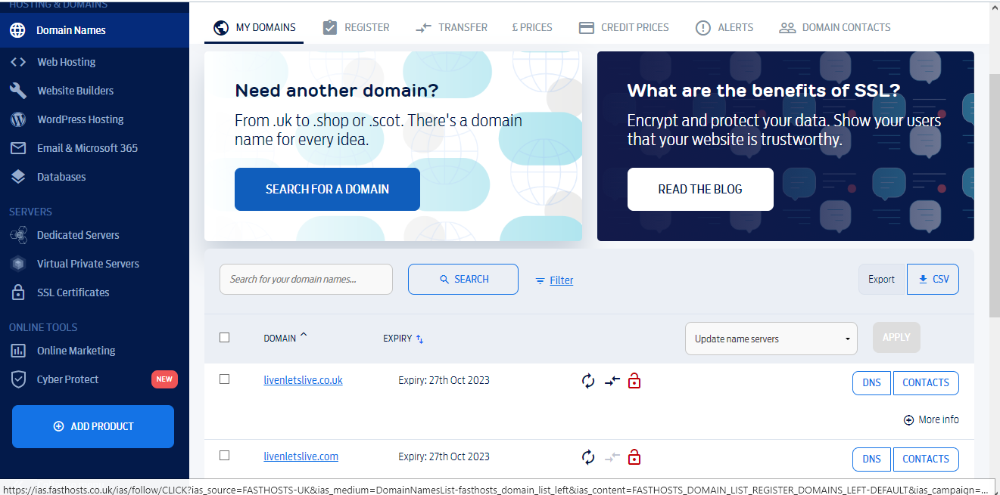
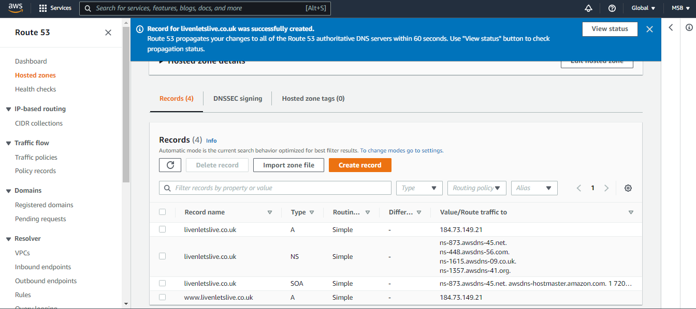
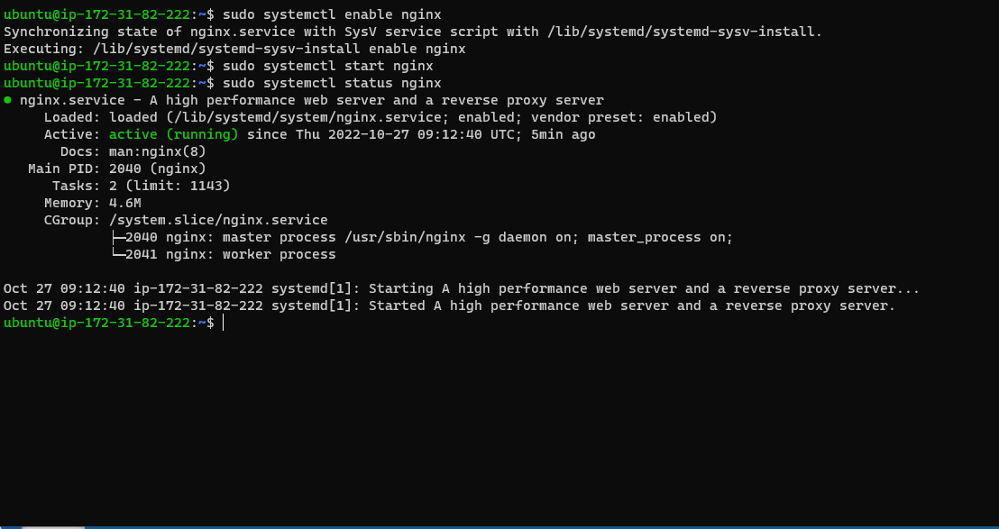
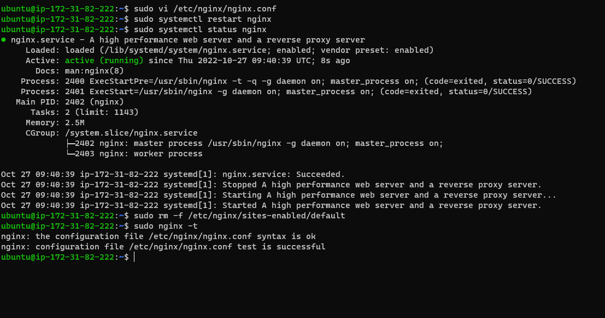
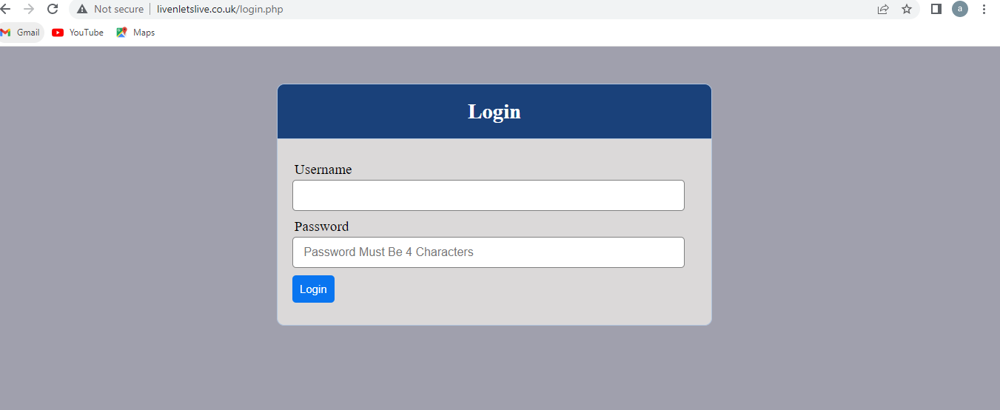

**LOAD BALANCER SOLUTION WITH NGINX AND SSL/TLS**

**domain created with fasthosts.co.uk**

****

**details of the domain sync with route 53**

****

**CONFIGURE NGINX AS A LOAD BALANCER**

****

**confirming if our nginx is successfully configured**

**sudo nginx -t**

****

**checking if the domain sites created redirected to our webserver**

**livenletslive.co.uk**

****

